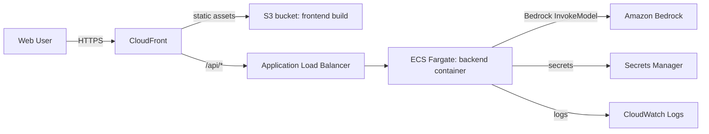

# AWS deployment artifacts (reviewable IaC — not applied)

These files are the Fargate/ALB deployment shape described in `dashboard_spec.md` §6.2, written as
reviewable configuration for a human to inspect, adapt, and apply through your own change-management
process. **Nothing here has been run** — no `aws` CLI command, no Terraform, no live AWS account
was touched while producing these files. Every `<ACCOUNT_ID>`, `<REGION>`, and `<TAG>` placeholder
must be filled in and reviewed before use.



## Files

| File | Purpose |
|---|---|
| `ecs-task-definition.json` | Fargate task definition for the backend container. Reads API keys from Secrets Manager (`secrets`, not `environment`) — no credential is ever a plain task-definition value. |
| `iam-task-role-policy.json` | Attach to the task role (`taskRoleArn`): scopes `bedrock:InvokeModel`/`InvokeModelWithResponseStream` to the specific Claude Sonnet 4 / 3.5 Sonnet model and cross-region inference-profile ARNs the dashboard uses — not `bedrock:*` on `*`. |
| `iam-execution-role-policy.json` | Attach to the execution role (`executionRoleArn`), **in addition to** the AWS-managed `AmazonECSTaskExecutionRolePolicy` (ECR pull + log group write). Adds only `secretsmanager:GetSecretValue`, scoped to the three named dashboard secrets. |

## Ordered setup (manual — review each step before running it)

1. **Build and push the backend image** to ECR (build context is the repository root — see
   `dashboard/backend/Dockerfile`):

   ```bash
   aws ecr create-repository --repository-name korchestrator-dashboard-backend
   docker build -f dashboard/backend/Dockerfile -t <ACCOUNT_ID>.dkr.ecr.<REGION>.amazonaws.com/korchestrator-dashboard-backend:<TAG> .
   aws ecr get-login-password --region <REGION> | docker login --username AWS --password-stdin <ACCOUNT_ID>.dkr.ecr.<REGION>.amazonaws.com
   docker push <ACCOUNT_ID>.dkr.ecr.<REGION>.amazonaws.com/korchestrator-dashboard-backend:<TAG>
   ```

2. **Create the three secrets** (never commit the real values — these commands take them from your
   shell/environment, not from any file in this repo):

   ```bash
   aws secretsmanager create-secret --name korchestrator-dashboard/bedrock-bearer-token --secret-string "$AWS_BEARER_TOKEN_BEDROCK"
   aws secretsmanager create-secret --name korchestrator-dashboard/openai-api-key --secret-string "$OPENAI_API_KEY"
   aws secretsmanager create-secret --name korchestrator-dashboard/anthropic-api-key --secret-string "$ANTHROPIC_API_KEY"
   ```

   Skip a secret and delete its entry from `ecs-task-definition.json`'s `secrets` array if that
   provider isn't in use (`Settings`/`os.environ.get` in `gateway.py` already treats an unset key
   as "provider unavailable", not an error).

3. **Create the IAM roles**, attaching `iam-execution-role-policy.json` (execution role, alongside
   the AWS-managed `AmazonECSTaskExecutionRolePolicy`) and `iam-task-role-policy.json` (task role).

4. **Fill in and register the task definition**: replace every `<ACCOUNT_ID>`, `<REGION>`, `<TAG>`
   in `ecs-task-definition.json`, then:

   ```bash
   aws logs create-log-group --log-group-name /ecs/korchestrator-dashboard-backend
   aws ecs register-task-definition --cli-input-json file://dashboard/aws/ecs-task-definition.json
   ```

5. **Create the ECS Fargate service** behind an ALB. Health check path `/api/config`, container
   port `8000`. **Set the ALB target group's and listener's idle timeout to at least 3600s** — the
   dashboard's SSE event stream (`/api/runs/{run_id}/stream`) is a long-lived connection, and the
   ALB default 60s idle timeout will drop it mid-run (`dashboard_spec.md` §6.2 already calls this
   out).

6. **Build the frontend for this backend's ALB DNS name and publish to S3 + CloudFront**:

   ```bash
   docker build -f dashboard/frontend/Dockerfile --build-arg VITE_API_BASE="" -t dashboard-frontend-build ./dashboard/frontend
   # or, without Docker: cd dashboard/frontend && VITE_API_BASE="" npm run build
   aws s3 sync dashboard/frontend/dist s3://<YOUR_FRONTEND_BUCKET> --delete
   ```

   Point CloudFront's default origin at the S3 bucket and add a second, path-pattern `/api/*`
   origin at the ALB, so the browser only ever sees one origin (matches the local nginx-proxy
   behavior in `dashboard/docker-compose.yml`, just implemented at the CDN layer instead of nginx).

## What this deliberately does not include

- **Temporal Cloud / self-hosted Temporal on EKS** (`dashboard_spec.md` §6.2's last bullet) — the
  SDK's Temporal runtime doesn't yet drive dashboard-visible hooks (see
  [ADR 0019](../../docs/adr/0019-governance-halt-veto-wired-in-hooks-and-pregel.md)'s Consequences
  section), so standing up durable infrastructure for it isn't justified yet. Scenario 4 runs
  against the local HITL mock in every environment described here.
- Terraform/CDK modules — these are plain JSON so they can be reviewed and adapted to whatever IaC
  tool your AWS account already standardizes on, rather than assuming one.
- Any actual `aws`, `terraform`, or `docker push` invocation — that requires your AWS account and
  explicit authorization, and is out of scope for this repository change.
