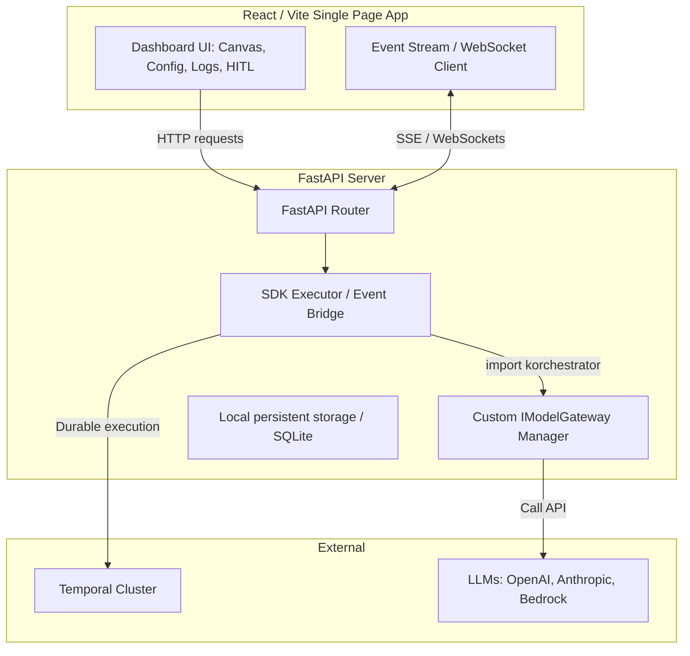
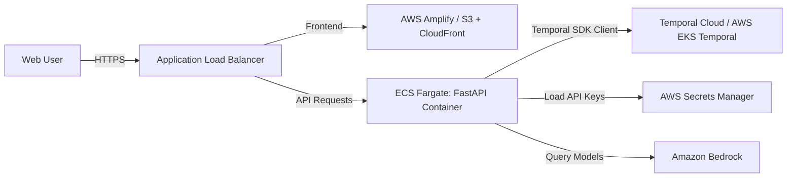

# Specification Document: Korchestrator SDK Dashboard & Testing System

This specification defines the architecture, design, test scenarios, and deployment strategy for a dedicated **Korchestrator Dashboard** web application. 

The dashboard operates as a **client application** of the Korchestrator SDK (`korchestrator`). It resides in a separate folder (`/dashboard`) to avoid modifying or overlapping the core SDK repository, treating the SDK as a standard installed library (e.g., as if installed via `pip install korchestrator`).

---

## 1. Overview & Objectives

The SDK provides durable, deterministic, multi-agent workflows as a Pregel-style Bulk Synchronous Parallel (BSP) execution substrate on top of Temporal. To validate this complex system locally and in cloud environments, the dashboard must:
1. **Test Core SDK Features:** Support Tier-1 (Architect auto-planning), Tier-2 (explicit Swarm building), and Tier-3/4 interfaces (local/Temporal runtimes, event streaming, tool use, and governance).
2. **Support Heterogeneous LLM Providers:** Provide a user interface to configure API keys and route agents to different models (OpenAI, Anthropic, Amazon Bedrock, etc.).
3. **Visualize Swarm Computations:** Show supersteps, parallel agent nodes, edge-based message flows, and state update merges.
4. **Demonstrate Human-in-the-Loop (HITL):** Highlight how the system pauses on low-trust decisions or policy limits and resumes upon human feedback.
5. **Be Deployable:** Ensure it can be run easily on a local machine (for developer testing) and packaged for AWS deployment.

---

## 2. Architecture & SDK Integration

The dashboard will be split into a frontend application and a backend API.



### 2.1 Technology Stack
*   **Backend:** FastAPI (Python 3.10+). It imports `korchestrator` directly and drives swarm execution in-process (or remotely via Temporal).
*   **Frontend:** React (Vite, TypeScript). Built using Vanilla CSS (or Tailwind CSS if requested) for premium, rich aesthetics. Graph representation is visualized using **React Flow** or **Vis.js**.
*   **Inter-process Communication:** Server-Sent Events (SSE) or WebSockets to stream SDK events (e.g., superstep execution, agent thinking state, messages) to the frontend in real time.

---

## 3. LLM Provider Gateway Integration

The SDK routes LLM requests through the `IModelGateway` port. By default, it uses `MockLM` (offline) or `OpenAIGateway` (OpenAI-compatible). 

To support a wide range of LLMs (OpenAI, Anthropic, Bedrock, etc.) and allow users to supply credentials dynamically via the frontend, the dashboard backend will implement a custom gateway: **`LiteLLMGateway`**.

### 3.1 Custom Gateway Design
`LiteLLMGateway` implements `IModelGateway` and utilizes the `litellm` library to translate the SDK's messaging requests to any backend LLM.

```python
import os
import litellm
from typing import Any
from korchestrator.interfaces import IModelGateway
from korchestrator.models.routing import ModelCard
from korchestrator.models.state import Message, MessageRole

class LiteLLMGateway(IModelGateway):
    """Custom dashboard model gateway wrapping LiteLLM.
    
    Supports OpenAI, Anthropic, Bedrock, and other providers with dynamic API keys.
    """
    def __init__(self, api_keys: dict[str, str], timeout_seconds: float = 30.0) -> None:
        self._api_keys = api_keys
        self._timeout_seconds = timeout_seconds

    def _prepare_env(self, provider: str) -> None:
        """Inject keys into environment variables dynamically for the execution thread."""
        for key, val in self._api_keys.items():
            os.environ[key] = val

    async def complete(
        self,
        messages: list[Message],
        *,
        model: str,
        max_tokens: int | None = None,
    ) -> Message:
        # 1. Map messages to LiteLLM/OpenAI chat completion format
        litellm_messages = [{"role": msg.role.value, "content": msg.content} for msg in messages]
        
        # 2. Extract provider name (e.g., 'anthropic/claude-3-5-sonnet' -> 'anthropic')
        provider = model.split("/")[0] if "/" in model else "openai"
        self._prepare_env(provider)

        # 3. Call litellm.acompletion
        response = await litellm.acompletion(
            model=model,
            messages=litellm_messages,
            max_tokens=max_tokens,
            timeout=self._timeout_seconds
        )
        
        # 4. Extract content and map back to korchestrator Message
        content = response.choices[0].message.content or ""
        return Message(
            sender="assistant",
            role=MessageRole.ASSISTANT,
            content=content,
            valid_time=None,  # Re-stamped by the SDK engine clock
        )

    async def available_models(self) -> list[ModelCard]:
        """Expose supported models to the router."""
        # Custom model catalog constructed based on supplied API keys
        models = []
        if "OPENAI_API_KEY" in self._api_keys:
            models.append(ModelCard(
                name="openai/gpt-4o", provider="openai", description="OpenAI GPT-4o",
                context_window=128000, cost_per_1k_input_usd=0.005, cost_per_1k_output_usd=0.015,
                latency_p50_ms=800, quality_score=0.95
            ))
            models.append(ModelCard(
                name="openai/gpt-4o-mini", provider="openai", description="OpenAI GPT-4o Mini",
                context_window=128000, cost_per_1k_input_usd=0.00015, cost_per_1k_output_usd=0.0006,
                latency_p50_ms=400, quality_score=0.80
            ))
        if "ANTHROPIC_API_KEY" in self._api_keys:
            models.append(ModelCard(
                name="anthropic/claude-3-5-sonnet", provider="anthropic", description="Anthropic Claude 3.5 Sonnet",
                context_window=200000, cost_per_1k_input_usd=0.003, cost_per_1k_output_usd=0.015,
                latency_p50_ms=1000, quality_score=0.97
            ))
        if "AWS_ACCESS_KEY_ID" in self._api_keys and "AWS_SECRET_ACCESS_KEY" in self._api_keys:
            models.append(ModelCard(
                name="bedrock/anthropic.claude-3-sonnet-20240229-v1:0", provider="bedrock", description="AWS Bedrock Claude 3 Sonnet",
                context_window=200000, cost_per_1k_input_usd=0.003, cost_per_1k_output_usd=0.015,
                latency_p50_ms=1100, quality_score=0.90
            ))
        return models
```

### 3.2 Dynamic Configuration Panel
The UI will render a security-conscious configuration modal where users paste credentials:
*   **OpenAI API Key** (`OPENAI_API_KEY`)
*   **Anthropic API Key** (`ANTHROPIC_API_KEY`)
*   **AWS Bedrock Credentials** (`AWS_ACCESS_KEY_ID`, `AWS_SECRET_ACCESS_KEY`, `AWS_REGION_NAME`)
*   These keys are held in state inside the React application and passed per-run via the API headers or stored securely in session-only cookies (they are never persisted to disk in the backend).

---

## 4. Target Testing Scenarios

To demonstrate the SDK's versatility, the dashboard supports four distinct testing scenarios.

### 4.1 Scenario 1: Autonomous Team Planning (Tier-1 "Korch" mode)
*   **Objective:** Validate the Architect meta-agent's ability to analyze a goal and auto-generate an agent team.
*   **Workflow:**
    1. The user enters an objective (e.g., `"Review a markdown file for security breaches and spelling errors"`).
    2. The backend instantiates `Korch(model_gateway=custom_gateway)`.
    3. The `ArchitectAgent` plans the team structure (number of agents, roles, backstories, model selections).
    4. The backend streams the generated JSON graph plan to the frontend.
    5. The engine executes the planned graph through local supersteps.
*   **Testing Focus:** Architect planning accuracy, intent classification (taxonomy), and local runtime execution.

### 4.2 Scenario 2: Swarm Designer (Tier-2 "Swarm" mode)
*   **Objective:** Validate custom agent topology building and message routing.
*   **Workflow:**
    1. The user visually builds a graph:
        *   Drag and drop agents (e.g., `analyst`, `critic`, `editor`).
        *   Assign custom roles, goals, backstories, and LLM models (e.g., `analyst` routes to `anthropic/claude-3-5-sonnet`, `critic` routes to `openai/gpt-4o-mini`).
        *   Draw directed connection lines (edges) between agents (e.g., `analyst` $\rightarrow$ `critic` $\rightarrow$ `editor`).
    2. The user inputs a objective (e.g., `"Analyze the Q3 product roadmap and create a critique"`).
    3. The backend runs a `Swarm` instance mapped to this topology.
*   **Testing Focus:** Multiple models executing concurrently in a single Pregel superstep, and topological message delivery across edges.

### 4.3 Scenario 3: Tool Integration & Safety Shielding (AUB & MCP)
*   **Objective:** Validate tool execution, rate limiting, and PII/secret redaction.
*   **Workflow:**
    1. Build a Swarm with two agents: `SearchAgent` and `ReporterAgent`.
    2. Mount tools on `SearchAgent`: a mock web-search tool and a calculation tool.
    3. Run a query: `"Search for the revenue of Acme Corp (which is $50M) and calculate the 10% tax rate"`.
    4. Apply `Shield` rule configurations (e.g., redact financial amounts or names).
    5. Show raw tool output in the backend vs. redacted output ingested by the agent's context graph.
*   **Testing Focus:** Agent Utility Bridge (AUB), custom tool execution, schema validation, and `Shield` regex redaction.

### 4.4 Scenario 4: Human-in-the-Loop (HITL) & Governance (Durable Runtime)
*   **Objective:** Validate policy checking, trust thresholds, and pause/resume functionality.
*   **Workflow:**
    1. Set the runtime to `temporal` and configure a trust threshold (e.g., `0.85`).
    2. Execute a swarm task. If the model gateway returns a response with a trust score below the threshold (or triggers a governance policy rule like "Sensitive Database Access"), the engine pauses the run.
    3. The status transitions to `governance_paused`.
    4. The UI displays an alert notifying the user that approval is required. The UI shows the decision trace (the bitemporal Context Graph state).
    5. The user reviews the trace, selects **Approve** or **Override**, and provides input.
    6. The backend sends a signal to the Temporal workflow, which resumes execution.
*   **Testing Focus:** Durable runtime, Temporal activity signaling, trust scoring, and bitemporal audit trails.

---

## 5. Dashboard Component Layout

The UI will be designed as a premium dark-themed single-page app structured into four columns/panels:

```
+-----------------------------------------------------------------------------------------+
|  [KORCHESTRATOR DASHBOARD]                                            [Runtime: Local]  |
+-----------------------------------------------------------------------------------------+
|  PANEL 1: CONFIG & SCENARIO   |  PANEL 2: SWARM GRAPH VISUALIZER                        |
|                               |                                                         |
|  * Select Scenario:           |  +---------------------------------------------------+  |
|    [ Scenario 1: Auto-Plan ]  |  |  (Agent: Analyst) ----> (Agent: Critic)           |  |
|                               |  |       |                     |                     |  |
|  * Credentials:               |  |       |                     v                     |  |
|    OpenAI Key: [*********]    |  |       +-------------> (Agent: Editor)             |  |
|    Anthropic Key: [******]    |  +---------------------------------------------------+  |
|                               |  PANEL 3: RUN LOGS & EVENT STREAM                       |
|  * Objective Input:           |  +---------------------------------------------------+  |
|  [ Research AI agents... ]    |  | [Superstep 1] Analyst is thinking...              |  |
|                               |  | [Superstep 1] Message sent: Analyst -> Critic     |  |
|  [ RUN WORKFLOW ]             |  | [Superstep 2] Critic: "The report looks great."   |  |
|                               |  +---------------------------------------------------+  |
+-------------------------------+---------------------------------------------------------+
|  PANEL 4: AUDIT & BITEMPORAL CONTEXT GRAPH            |  HITL INTERACTION MODAL (PAUSED)|
|  * Facts: { "revenue": "$50M", "valid_time": ... }    |  "Action requires review. Approve?"|
|  * Transaction time: 2026-07-29T20:40:00Z             |  [ APPROVE ]    [ REJECT & EDIT ]|
+-----------------------------------------------------------------------------------------+
```

### 5.1 Panel Descriptions
*   **Panel 1: Control & Scenarios:** Configure LLM keys, select the test scenario, edit the swarm parameters, set runtime config (Local/Temporal, max supersteps), and input the objective.
*   **Panel 2: Topology Canvas:** Uses `React Flow` to draw a clean node-link graph of the agent network. Nodes pulse green when executing in parallel, turn grey when halted, and transition to yellow during HITL pauses. Message deltas (State Updates) flow visually along the links.
*   **Panel 3: Real-Time Event Feed:** Emits logs of internal SDK events. It tracks superstep counters, message details, tool invocations, and execution timing.
*   **Panel 4: Bitemporal Context Graph & HITL:** Displays the state of the context graph. It lets users "scrub" through supersteps (time travel) to see what facts were known at any point in transaction-time. If execution is paused, this panel activates the HITL approval terminal.

---

## 6. Local Setup & AWS Deployment Guide

The entire system is designed to run seamlessly in local environments for development and package for AWS for cloud testing.

### 6.1 Running Locally
A script inside `/dashboard` allows quick bootup:

1.  **Clone the Repo and Install SDK + Dashboard Dependencies:**
    ```bash
    # Install the SDK in editable mode
    pip install -e '.[all]'

    # Install dashboard dependencies (FastAPI, Uvicorn, LiteLLM)
    cd dashboard
    pip install -r requirements.txt
    ```

2.  **Spin up Temporal (Optional, needed for Scenario 4):**
    ```bash
    # Run Temporal server locally via CLI or Docker
    temporal server start-dev
    ```

3.  **Launch the Dashboard Backend & Frontend:**
    ```bash
    # Start FastAPI backend
    python -m uvicorn app.main:app --reload --port 8000

    # Start React frontend (in dashboard/frontend)
    npm install
    npm run dev
    ```

### 6.2 Cloud Deployment (AWS)



1.  **Containerization (Docker):**
    We write a multi-stage `Dockerfile` that builds the React frontend static assets, copies them to the FastAPI static directory (or serves them via Nginx), and packages the backend python server.
2.  **API Gateway / ALB & ECS Fargate:**
    *   Deploy the container as a service on **AWS ECS Fargate** behind an **Application Load Balancer (ALB)**.
    *   Configure WebSockets/SSE connection timeouts on the ALB (e.g., increase timeout to 3600 seconds) to avoid dropping active swarm execution streams.
3.  **Secrets & LLM Provisioning:**
    *   Integrate **AWS Secrets Manager** to fetch default LLM keys on startup.
    *   For **Amazon Bedrock**, configure the ECS Task Execution Role with IAM policies granting access to the specific Bedrock model IDs (e.g., `anthropic.claude-3-sonnet`). The dashboard backend will load these credentials transparently via AWS SDK (`boto3`).
4.  **Temporal Hosting:**
    *   Connect the durable runtime to **Temporal Cloud** or deploy a private Temporal cluster in EKS (Elastic Kubernetes Service) using PostgreSQL on Amazon Aurora as the persistence engine.

---

## 7. Development Roadmap

1.  **Phase 1: Setup & Custom Gateway (2 days)**
    *   Create the `/dashboard` folder structure.
    *   Implement `LiteLLMGateway` conforming to `IModelGateway`.
    *   Setup FastAPI endpoints for dynamic API key storage and configuration validation.
2.  **Phase 2: Event Streaming Backend (2 days)**
    *   Implement execution runner helper utilizing SDK façade `Korch` and `Swarm`.
    *   Integrate event streaming via SSE to push SDK execution events to client.
3.  **Phase 3: React UI & Graph Canvas (3 days)**
    *   Setup Vite React app inside `/dashboard/frontend`.
    *   Build the interactive configuration page and the `React Flow` swarm visualizer.
    *   Connect frontend to SSE endpoint to render active states and message flows.
4.  **Phase 4: HITL & Temporal Setup (2 days)**
    *   Write a custom middleware/observer to intercept governance halts.
    *   Build the frontend approval prompt and connect it to a resume endpoint (using Temporal client signals).
5.  **Phase 5: Containerization & Cloud Manifests (1 day)**
    *   Write `Dockerfile` and `docker-compose.yml`.
    *   Write AWS ECS task definition and deployment scripts.
