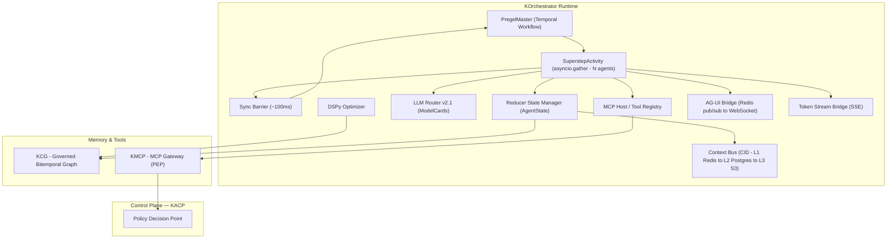

# Kendra Orchestrator (KOrchestrator) — Complete Product & Technical Reference (for SDK Build)

> **📎 Source input, not a working specification.** This is the product and platform reference the
> SDK specification was derived from. The authoritative, maintained specification set lives in
> [`docs/specs/`](../specs/README.md); decisions live in [`docs/adr/`](../adr/README.md).
>
> Read this for **product context** — what KOrchestrator is, the platform it sits in, the built-vs-backlog
> status in §15, and the scaling blueprint in §16. Build from `docs/specs/`. Where the two disagree,
> the specs win.

<aside>
🧭

**What this is.** A single, complete reference for **Kendra Orchestrator (KOrchestrator)** — synthesised from every KOrchestrator source in the workspace (the 8-part Definitive Documentation set, the Phase 2 Execution Platform spec, the Kendra Studio frontend spec, the competitive roadmap, and the engineering roadmap) plus the Google Drive research corpus (the hyperscale scaling blueprint, Pregel/FractalFlow analyses, and the Studio spec). It covers **what KOrchestrator is, what it does, every feature, how it is built today, how it should be built, and an honest built-vs-backlog status** — organised so it can be used as the product/technical basis for building the **KOrchestrator SDK**.

</aside>

> **How to read this for SDK work.** Sections 1–4 give the mental model. Sections 5–12 are the feature surface (the "what the SDK must expose or talk to"). Section 13 is the concrete SDK-facing surface (API, data models, config, workflow types). Section 14 is the master feature list. Section 15 is the honest built-vs-backlog status so you know what is real today vs specced. Section 16 covers scale. Section 17 is SDK design guidance derived from all of the above.
> 

---

# 1. What KOrchestrator is

KOrchestrator is the **durable, multi-agent execution runtime — the "kernel" — of the Kendra Labs platform**. It is the runtime that actually *runs* multi-agent AI workflows ("swarms"): it handles the **lifecycle of agent swarms — building, planning, running, monitoring, pausing, resuming and executing them**.

Technically, it runs each swarm as a **Pregel-style Bulk-Synchronous-Parallel (BSP) computation on top of Temporal**. This gives every multi-agent run: crash-proof durability, deterministic replay, parallel fan-out across 100+ agents, and bitemporal (time-travel) auditability.

<aside>
⚖️

**Scope boundary (critical for the SDK).** The scope of the orchestrator is *strictly limited* to the lifecycle of agent swarms — building, managing, running, monitoring, and executing them. It is **not** designed to handle persistence of institutional knowledge, context creation, or identity storage. Those functions belong to sibling systems (KACP control plane, KCG memory graph, KIAM identity). The SDK should expose orchestration, not re-implement memory/identity/policy.

</aside>

## 1.1 How KOrchestrator relates to the rest of the platform

| System | Role | Relationship to KOrchestrator |
| --- | --- | --- |
| **KOrchestrator** | Durable multi-agent **execution runtime** (the kernel) | The engine that runs governed work |
| **KACP** (Agentic Control Plane) | Policy, lifecycle, RuleOps — the **Policy Decision Point (PDP)** | Governs what the orchestrator is allowed to do |
| **KCG** (Kendra Context Graph / Nexus) | Bitemporal memory + decision-trace / observability graph | Where the orchestrator writes its memory & audit trail |
| **KMCP** (Kendra MCP Server) | Enterprise tool gateway — the **Policy Enforcement Point (PEP)** | Every tool call the orchestrator makes flows through it |
| **KIAM** | Identity & access (Keycloak-issued JWTs, wallets) | Supplies tenant + agent identity and cost wallets |
| **Kendra Studio** | Web UI for launching/observing runs | The product surface on top of the engine |
| **Kendra AI Gateway** | Model hosting / routing internals | Where LLM calls are ultimately routed |

## 1.2 Product vision & who it's for

- **Vision:** be *the durable, governed, self-optimizing runtime for autonomous multi-agent systems* — with a memory-and-observability graph (KCG) that LangSmith cannot be.
- **Business objectives:** productionise KOrchestrator as the first live module of the Kendra Labs platform; support an **OEM / white-label** model so other companies embed the engine; unblock regulated buyers (HIPAA / SOC 2 / FCA) via multi-tenant sharding and regulator-grade audit.
- **Target users:** enterprise AI/platform teams (Python & TypeScript); internal Kendra Fabric product teams; OEM partners embedding the engine; platform/DevOps engineers operating swarms at scale.

## 1.3 Problems it solves

- Agent runs that lose state on crash, cannot be replayed, and offer no provenance.
- No governed memory: context is either lost or ungoverned, with no time-travel or ACL.
- No native cost control over LLM spend inside long-running multi-agent workflows.
- Observability bolted on as flat logs instead of a queryable causal graph.

---

# 2. Core design principles (the "why")

1. **Durable by default.** Built on Temporal; agent state is checkpointed every superstep. On infrastructure failure a run resumes exactly where it left off — P(state loss) ≈ 0.
2. **Pregel BSP determinism.** Work proceeds in *supersteps* separated by a global sync *barrier* (~100 ms), giving reproducible, replayable execution. State transition: `S(t+1) = f(S(t), M(t))`.
3. **Why Pregel, not DAGs.** Classic agent frameworks model work as a directed acyclic graph. DAGs cannot express the **cyclic, self-correcting, dynamically-branching** behaviour real multi-agent systems need (reflection, retries, multi-turn negotiation). Pregel treats cycles as first-class.
4. **Agent execution ≠ code execution.** An agent may wait days for a human approval, so **agent state is decoupled from process state** and made durable — an idle agent consumes no compute.
5. **Massively parallel, single activity.** One `SuperstepActivity` runs `asyncio.gather` across all active agents — it does **not** spawn a child workflow per agent, keeping 100+ agents off Temporal's event-history hot path (avoiding DB blow-up).
6. **Reducer-driven state.** Shared state mutates only through typed reducer channels, so concurrent writes are well-defined (no last-writer-wins races).
7. **Bitemporal memory.** Every fact carries valid-time + transaction-time — "what did the agent know, and when did we record it" is always reconstructable.
8. **Observability-native.** OpenTelemetry GenAI 2026 span trees plus reified decision traces written to KCG.
9. **Human-in-the-loop as a primitive.** HITL pauses use Temporal signals / `wait_condition`; an idle agent awaiting approval consumes no compute.
10. **Model-agnostic routing.** LLM Router v2.1 picks models by semantic fit + cost + latency + capability via externalised ModelCards.
11. **Multi-tenant & zero-trust.** Per-tenant KCG project derived from the KIAM JWT; mTLS mesh; SHIELD PII redaction; KMCP enforces policy on every tool call.

---

# 3. Reference architecture

## 3.1 Component reference diagram

## 3.2 FractalFlow tiers

The runtime is organised as four tiers ("FractalFlow") that separate the deterministic orchestrator from the distributed agent mesh:

| Tier | Name | Contains |
| --- | --- | --- |
| **Tier 1** | Runtime Kernel | Root Orchestrator (Temporal), Global State Manager (Redis/Postgres), Global Sync Barrier |
| **Tier 2** | Distributed Mesh | Subgraph Planners, specialised Worker Agents |
| **Tier 3** | Intelligence & Routing | LLM/Financial Router, Architect Agent (DSPy) |
| **Tier 4** | Governance & Observation | OTel 2026 Collector, KACP Shield (identity-aware), Context Graph (Neo4j) |

**Data flow:** Router → Root Orchestrator → Planners → Workers → Barrier → State → Memory (KCG), with Workers streaming to OTel and the Barrier checked against the Shield.

---

# 4. How it works — the superstep lifecycle

Each multi-agent run is a sequence of **supersteps**. One superstep = five phases:

1. **Plan** — the Architect Agent (or a preset topology) produces the typed agent graph.
2. **Compute** — all active agents run concurrently (`asyncio.gather`) against a *frozen* snapshot of shared state.
3. **Synchronise (barrier)** — wait for every compute task to finish (~100 ms budget); prevents race conditions.
4. **Reduce** — agent updates (`StateUpdate` deltas) are merged into global state via deterministic reducers.
5. **Checkpoint** — the new state is durably persisted so the session can resume after a crash.

The critical engineering decision: the orchestrator runs as a single **`PregelMaster` Temporal workflow** that invokes **one `SuperstepActivity` per superstep**. That activity fans out to all active agents with `asyncio.gather` — it does **not** spawn a child workflow per agent. This keeps 100+ concurrent agents off the Temporal event-history hot path while still inheriting Temporal's durability and replay guarantees.

## 4.1 BSP → Temporal mapping

| Pregel concept | Temporal primitive |
| --- | --- |
| Agent session | Workflow (can sleep for months) |
| Thinking / compute step | Activity (auto-retried with backoff) |
| Human-in-the-loop | Signal (workflow waits at the barrier) |
| Checkpoint | Event history + durable state |

A single **`PregelMaster`** workflow drives the loop; its activities are `plan_execution_activity`, `initialize_graph_activity`, `run_superstep_activity` (which drives `PregelRunner`), `ingest_trace_activity`, and `emit_agui_event_activity`. **Hierarchical supervision** is supported: manager graphs orchestrate specialised worker subgraphs, and subgraphs can be recursively inlined ("graph inception") for fractal decomposition.

---

# 5. Core runtime components

| Component | Responsibility |
| --- | --- |
| **PregelMaster** | Temporal workflow driving the superstep loop; owns durability, replay, checkpointing |
| **SuperstepActivity** | Single activity running `asyncio.gather` over all active agents; enforces the sync barrier |
| **Reducer State Manager** | Applies typed reducer channels to `AgentState`; deterministic merge of concurrent writes |
| **Context Bus** | SHA-256 content-addressable store (L1 Redis → L2 Postgres → L3 S3); state holds CID pointers, not blobs |
| **Context Lifecycle Manager** | MemGPT tiering (Working / Storage / Paging); prunes & offloads cold context to KCG vectors |
| **LLM Router v2.1** | Semantic + cost + latency + capability routing via externalised ModelCards; ≥4 fallback models; supersedes the v2.0 four-tier Financial Router |
| **DSPy Optimizer** | Compiles agent Signatures with Teleprompters; pulls historical DecisionTraces from KCG as few-shot exemplars (compile-for-cost vs compile-for-quality) |
| **MCP Host / Tool Registry** | `MCPClientFactory`, `ToolRegistry`, `IdentityPropagator` (KIAM DID JWT); stdio + SSE transports; MCP progressive disclosure |
| **AG-UI Bridge** | Redis pub/sub → WebSocket; emits thought / tool_call / tool_result / workflow_state / human_request; CopilotKit generative UI; HITL via Temporal signal |
| **Token Stream Bridge** | SSE `GET /v1/run/{id}/tokens`; `token_chunk` / `token_done`; in-process asyncio queue + cross-process `POST /v1/internal/token_chunk` |

---

# 6. State, memory & data architecture

## 6.1 Core data models

- **`AgentState`** — the global shared state threaded through every superstep: `run_id: UUID`, `messages: List[Message]`, `context: Dict`, `superstep: int`, `halted: bool`, `status: RunStatus`, `transaction_time`.
- **`Message`** — inter-agent message: `role` (SYSTEM / USER / ASSISTANT / TOOL), `content`, `valid_time`.
- **`StateUpdate`** — the typed delta an agent emits: `agent_id`, `updates`, `valid_time`.

## 6.2 Reducer channels (deterministic merge)

| Reducer | Behaviour |
| --- | --- |
| `LastValue` | Keep the most recent value |
| `Append` | Append to a list channel |
| `UniqueAppend` | Append only new (deduplicated) items |
| `MergeDict` | Deep-merge mapping channels |

Determinism is mandatory because Temporal replays workflow code in a sandbox (no `random`, no `datetime.now()` in workflow scope).

## 6.3 Three-tier storage

| Tier | Store | Purpose | Retention |
| --- | --- | --- | --- |
| 1 — Transient working memory | Redis | Message buffers, partial tool outputs during compute | Short-lived |
| 2 — Durable state & checkpoints | PostgreSQL | Superstep checkpoints; crash recovery & resumption | Session-durable |
| 3 — Institutional memory | Neo4j (+ S3 archival) | Bitemporal Context Graph; long-term facts & decision traces | 7-year WORM |

## 6.4 Content-addressed context bus

Payloads are addressed by **SHA-256 CID**, tiered L1 Redis (hot) → L2 Postgres (warm) → L3 S3 (cold), so `AgentState` carries pointers rather than large blobs.

## 6.5 Bitemporal memory & KCG

Each superstep writes **Decision** and **Event** nodes (plus `TrustScore` nodes) to KCG via `ingest_trace_activity`. Bitemporality (valid-time + transaction-time) answers "what did the agent know at the moment it decided?" — e.g. proving an agent saw a 700 credit score at decision time even if later corrected to 500.

---

# 7. Intelligence, planning & model routing

## 7.1 The Architect Agent (DSPy)

A meta-agent that does **intent analysis**, selects tools from the MCP registry, and assembles the agent graph autonomously. Built from DSPy modules (e.g. `IntentSignature`) rather than raw prompts, so planning is model-agnostic and optimisable; it supports sandbox-based self-correction and falls back to mock planning on failure.

**Mock intent templates:** order/invoice/payment → Financial pipeline (o2c); review/audit/security/code → Review panel; write/blog/content → Content pipeline; default → Research pipeline (researcher → analyst → writer).

## 7.2 Advanced planning capabilities

- **Speculative execution ("parallel universes").** Fork multiple candidate continuations, run in parallel, and a **Judge** node selects the best (fork-join; trades compute for reliability). *(Phase 2.)*
- **Recursive subgraph inception.** Agents spawn subgraphs that are themselves full Pregel graphs.
- **FIPA-lite agent communication** for structured inter-agent messages.
- **DSPy optimisation loop.** An `OptimizerService` continuously pulls DecisionTraces from KCG to improve DSPy modules.

## 7.3 LLM Router v2.1

Composite router across three strategies: **Semantic** (embedding similarity vs ModelCard descriptions), **Algorithmic** (cost/latency optimisation), **Explicit** (`AGENT_MODEL_MAP` overrides). ModelCards declare capability/cost/latency with ≥4 fallbacks. Built-in defaults until the ModelCard API is live: gpt-4o-mini, claude-3.5-sonnet, gpt-4-turbo, llama-3-8b, llama-3-70b.

## 7.4 Swarm-level cost control (FinOps)

- **Pre-run cost estimate** (agents × supersteps × per-agent profile), checked against the wallet before the first superstep — overspending runs are rejected/downshifted up front.
- **Agent pocket-money quotas** bound to each agent's identity; exhaustion trips a circuit breaker.
- **Self-consistency scaling** (e.g. 3 → 7 agents) is eval-gated and hard-bounded by budget.
- **Edge/contribution pruning** removes low-value agents from the swarm graph.
- **Coordination-budget topology selection** (peer-to-peer ~O(n²) vs manager-worker) to bound message overhead.

---

# 8. Integration bridge, tools & streaming

- **MCP host bridge** — `MCPClientFactory`, `ToolRegistry`, `IdentityPropagator`; progressive disclosure (agents *mount* only the few tools they need out of thousands); stdio + SSE transports; aligns with the KMCP gateway.
- **Observability** — hierarchical OpenTelemetry GenAI 2026 span tree: `agent.run → agent.plan → tool.call → gen_ai.call` (workflow → superstep → agent → tool/LLM).
- **AG-UI protocol** — real-time generative UI via Redis pub/sub → WebSocket; CopilotKit binding; emits thought / tool_call / tool_result / workflow_state / human_request; HITL via Temporal signal (`workflow.wait_condition`).
- **Token streaming** — SSE `GET /v1/run/{id}/tokens`; a browser WS surface exists but is *not* in the OpenAPI spec (use SSE for codegen).
- **Swarm Console** — a thin demo client proxying to the engine (`POST /runs` → `POST /v1/run/auto`, etc.). Demo-grade, not a product.

---

# 9. Governance, security & multi-tenancy

- **GovernanceEngine & HITL** — per-superstep `check_governance_activity`; when an agent's **trust score** drops below threshold, the workflow pauses (signal) and an operator resumes/cancels. Trust scores persist to KCG for cross-session reputation continuity.
- **Redaction (SHIELD)** — `RedactionMiddleware` / `ShieldRedactor` masks PII to `[MASKED_<TYPE>]` on the ingest path (spaCy `en_core_web_sm`, regex fallback) before any trace reaches KCG.
- **Identity (KIAM)** — Keycloak-issued JWTs; OAuth2-style scopes `korchestrator:read` / `:write` / `:admin`; per-vertex DID/JWT propagation.
- **Governed tool calling** — tool calls never authorise locally; they traverse KMCP as the **PEP**, which calls the KACP **PDP** and **fails closed** on timeout. No direct vendor SDK calls in agent code.
- **Multi-tenant isolation** — tenant resolved from the JWT (precedence `tenant_id → azp → sub → "default"`); workflow IDs `korch-{tenant}-{run}`; KCG sharded per tenant (project auto-created on first use); per-tenant task queues. Unblocks HIPAA / SOC 2 / FCA.
- **Network** — mTLS service mesh (Envoy / Istio / Linkerd sidecars) propagating `X-Agent-DID`; the orchestrator never initiates inbound connections into worker networks.
- **Audit** — immutable decision subgraphs exported PROV-O / PROV-JSON to a 7-year WORM vault; audit becomes a graph query.
- **RBAC** — per-vertex RBAC chain: KOrchestrator vertex → KIAM principal → KMCP allowlist → KCG OpenFGA tuples (edge/row-level ACL).

---

# 10. API, operations & deployment

## 10.1 REST & streaming API (current engine surface)

| Method & path | Scope | Purpose |
| --- | --- | --- |
| `POST /v1/run` | write | Start a run with an explicit graph |
| `POST /v1/run/auto` | write | Start a run; Architect Agent plans the graph |
| `GET /v1/run/{id}` | read | Full live state (messages, graph, routing) |
| `GET /v1/run/{id}/stream` | read | SSE trace/completed events (thought / tool_call / tool_result / workflow_state / human_request) |
| `GET /v1/run/{id}/tokens` | read | SSE token stream (`token_chunk` / `token_done`) |
| `POST /v1/run/{id}/resume` | write | Resume a governance-paused run |
| `POST /v1/run/{id}/cancel` | write | Cancel a run |
| `POST /v1/runs/{run_id}/signal` | write | External signals incl. HITL approve/reject responses |
| `GET /runs` | read | List runs |
| `POST /v1/auth/jwks-refresh` | admin | Refresh JWKS |
| `GET /kcg/runs/{id}/graph` | read | KCG nodes written for a run |
| `PUT /api/v1/orchestrator/workflows/{id}/settings` | write | Workflow settings |

**Phase 2 additions to target as they land:** `POST /v1/workflows/{id}/execute`, `GET /v1/runs/{id}/events`, schedules, and idempotency keys.

## 10.2 Key configuration & operations

- **Env vars:** `KIAM_ENABLED` / `KIAM_ISSUER`, `TEMPORAL_NAMESPACE`, `TEMPORAL_API_KEY` (auto-TLS), `TEMPORAL_TASK_QUEUE`, `AGENT_MODEL_MAP`, `PII_SERVICE_URL`, `MOCK_LLM`, `STATE_STORE_BACKEND` (memory | redis), `REDIS_URL`.
- **Temporal cluster:** Frontend ×3 → History ×3 (512 shards) / Matching ×3; Postgres (RDS Multi-AZ) for `temporal` + `temporal_visibility`; S3 archival. One worker per `run_korchestrator.sh` invocation; **all workers must run the same code version.**
- **Dev/ops scripts:** `run_korchestrator.sh` (start full stack; `--live` real LLMs, `--stop`, `--status`); `infra/scripts/korch-up.sh`, `korch-deploy.sh`, `korch-watchdog.sh`; `kcg_harness.py` (health, test, smoke-test, monitor, graph). Roadmap CLI (Pillars A/B): `korch dev`, `korch pull <run>`, `korch replay --from-superstep N`.

---

# 11. Workflow topology presets

| `workflow_type` | Agents | Topology | Best for |
| --- | --- | --- | --- |
| `dynamic` | Architect decides | Varies | Open-ended goals |
| `three-agent` | 3 | Linear | Research synthesis (researcher → analyst → writer) |
| `o2c` | 7 | Linear | Order-to-cash finance pipeline |
| `code_review` | 4 | Fan-in | Multi-perspective review |
| `content_production` | 4 | Linear | Content creation |
| `financial_analysis` | 4 | Hybrid | Investment analysis |

---

# 12. KL DSL — declarative authoring front-end (specced, not built)

A second authoring surface that complements the emergent Pregel swarm: a **declarative, statically-analysable workflow language that compiles to Temporal** for predictable, guard-railed pipelines. (The Pregel swarm runtime executes emergent multi-agent supersteps; the KL DSL prioritises explicit control flow over reactive LLM routing.)

- **Explicit control flow:** `Sequence`, `Parallel`, `While`, `ForEach`, `Condition` — LLMs choose only among statically-defined branches.
- **Composability:** Agents and Skills are interchangeable, versioned, and nestable.
- **Compiler = determinism boundary:** all LLM / vector / 3rd-party calls wrapped in Temporal Activities; one script → one parent Workflow; nested agents / parallel branches → Child Workflows.
- **Execution-backend routing:** inline `asyncio.gather` for bounded, short-lived, stateless fan-out; Child Workflows for HITL, long waits, or versioned sub-agents; a hard **cardinality cap** shards wide fan-out.
- **Safety guards:** auto idempotency keys on state-mutating calls, hard execution-step limit, static dry-run check.
- **HITL as a first-class node:** `HumanApproval` with `on_approve` / `on_reject` / `on_timeout`, `assignees` / `roles`, `timeout_duration` → `NotifyPendingApprovalActivity` + time-bound await on an `approval_response` signal, with strict UI/Temporal state separation and an audit ledger.
- **Polymorphic UI block schema:** typed `context` blocks (`markdown`, `key_value`, `code_diff`, `json_tree`, `iframe`) with an editable-state override path.
- **Observability:** map Temporal failures back to the DSL line/node; visual progression through the user's graph.

<aside>
⚖️

**Reconciliation.** The KL DSL's child-workflow mapping is a coarse-grained *composition* boundary (versioned sub-agents / parallel branches) and does **not** contradict the kernel's single-`SuperstepActivity` fan-out, which handles intra-superstep agent parallelism within a swarm. They are distinct execution surfaces.

</aside>

---

# 13. SDK-facing surface (build reference)

This section consolidates the concrete contracts an SDK must wrap or expose.

## 13.1 Run lifecycle the SDK must cover

- **Start:** explicit graph (`POST /v1/run`) or auto-planned (`POST /v1/run/auto`, with `objective`, `workflow_type`, `mock_mode`).
- **Observe:** poll (`GET /v1/run/{id}`), SSE event stream (`/stream`), SSE token stream (`/tokens`), KCG graph (`/kcg/runs/{id}/graph`).
- **Control:** `signal` (incl. HITL approve/reject), `resume`, `cancel`.
- **List:** `GET /runs`.
- **Phase 2 targets:** `execute`, `events`, `status`, schedules, idempotency keys.

## 13.2 Object model (Phase 2 platform)

Workflow / Run / Step / Event / Artifact, plus a **worker plane** (outbound-only, registration, versioning, blue/green), **payload security** (encryption-at-source + offload to tenant blob), default-on observability, **scheduling** (cron/recurrence + dedupe), rich retry/timeout/circuit-breaker policies, and idempotency keys. **NFR targets:** p95 stream latency < 500 ms; 10k concurrent runs/region.

## 13.3 Auth & tenancy the SDK must propagate

KIAM JWT with scopes `korchestrator:read` / `:write` / `:admin`; tenant derived from JWT; DID/JWT propagated per vertex; every call org/project-scoped.

## 13.4 Data types the SDK exposes

`AgentState`, `Message` (role/content/valid_time), `StateUpdate` (agent_id/updates/valid_time), `RunStatus`, reducer channel types, ModelCard, and the six workflow-type presets.

## 13.5 Two target languages

Python SDK (Orchestrator SDK) + examples; TypeScript SDK + examples; a `korch` CLI (`dev`, `pull`, `replay`). All three are currently **backlog** — this document is the basis to build them.

---

# 14. Master feature list — everything KOrchestrator does / should do

<aside>
✅

**Execution kernel**

</aside>

- Durable Pregel BSP orchestrator (`PregelMaster` + single `SuperstepActivity`)
- Parallel superstep compute + global sync barrier (~100 ms)
- Reducer-driven shared state (LastValue / Append / UniqueAppend / MergeDict)
- Bitemporal checkpointing & crash-safe resume (Temporal event history)
- Hierarchical supervision + recursive subgraph inception
- Speculative execution + Judge node (fork-join) — *Phase 2*

<aside>
🧬

**State & memory**

</aside>

- `AgentState` / `Message` / `StateUpdate` typed models
- MemGPT-style context tiering (Working / Storage / Paging)
- SHA-256 content-addressable context bus (Redis → Postgres → S3)
- Three-tier storage (Redis / Postgres / Neo4j+S3, 7-yr WORM)
- Bitemporal decision/event/trust-score writes to KCG

<aside>
🤖

**Intelligence & routing**

</aside>

- Architect Agent (DSPy intent → graph synthesis, self-correction, mock fallback)
- LLM Router v2.1 (semantic + algorithmic + explicit, ≥4 fallbacks)
- DSPy optimisation loop fed by KCG traces
- FIPA-lite agent communication
- Swarm-level FinOps (pre-run estimate, quotas, self-consistency scaling, edge pruning, topology cost)

<aside>
🌉

**Integration, tools & streaming**

</aside>

- MCP host bridge with progressive disclosure + identity propagation
- OTel GenAI 2026 span trees
- AG-UI real-time generative UI (thought / tool_call / tool_result / workflow_state / human_request)
- SSE token streaming

<aside>
🔐

**Governance, security & tenancy**

</aside>

- Per-superstep GovernanceEngine + trust-score-gated HITL pause/resume
- SHIELD PII redaction
- KIAM scoped JWT auth
- Multi-tenant isolation + per-tenant KCG sharding
- mTLS service mesh with `X-Agent-DID`

<aside>
🛠️

**API, ops & workflows**

</aside>

- REST + SSE streaming API; run resume/cancel/signal; KCG graph read
- Six workflow topology presets (dynamic / three-agent / o2c / code_review / content_production / financial_analysis)
- Config via env vars; self-hosted or Temporal Cloud; worker lifecycle scripts

<aside>
🧩

**Authoring & product surfaces (mostly backlog)**

</aside>

- KL DSL declarative authoring + compiler + safety guards + HITL node + polymorphic UI schema
- Phase 2 platform (Execution API v1, worker plane, payload encryption/offload, scheduling, retry policies)
- Kendra Studio (runs / trace / KCG / tokens / logs UI, auth, billing/usage/limits, builder, schedules, audit/export)
- Python & TypeScript SDKs + `korch` CLI
- Local-first DX (`korch dev`), time-travel fork/resume, code-native nodes, resilient MCP gateway, event/trigger surface, open-core multi-tenant self-host

---

# 15. Built vs. backlog — honest status (beta-1.0, 2026)

<aside>
🧭

**Honesty-first summary.** The durable execution *kernel is built*. Almost everything that turns it into a *product* — Kendra Studio, the SDKs, the governed KCG retrieval/observability layer, autonomous planning, and the KL DSL — is still backlog. **This directly shapes SDK scope: the SDK will wrap a working kernel + REST/SSE surface, but must be designed against Phase 2 contracts for the parts not yet shipped.**

</aside>

| Capability | Status |
| --- | --- |
| Durable Pregel orchestrator · parallel superstep + barrier | ✅ Done |
| Reducer-driven state manager · core Pydantic models | ✅ Done |
| Bitemporal auditing & checkpointing | ✅ Done |
| Financial Router (v2.0→v2.1) · AG-UI bridge · in-memory tool registry | ✅ Done |
| Architect Agent (DSPy planning + live path) | ✅ Done |
| KIAM scoped JWT auth · multi-tenant isolation · Temporal Cloud | ✅ Done (Sprint 3) |
| Token streaming v1.0 | ✅ Done |
| ExecuteToolActivity · MCPHost core | 🟡 In progress |
| Governed Context Graph (Hybrid GraphRAG, decision-trace ingestor, pruner) | ⛔ Backlog |
| Intelligence & planning (speculative exec, recursive subgraph, FIPA-lite) | ⛔ Backlog |
| Integration & observability bridge (OTel GenAI 2026, MCP 2.0 dynamic host) | ⛔ Backlog |
| AUB & real-time streaming productisation | ⛔ Backlog |
| Kendra Studio UI (E0–E10) + TypeScript SDK | ⛔ Backlog |
| KL DSL authoring + compiler + HITL + polymorphic schema | ⛔ Backlog |

**Known beta gaps (workarounds exist):** stale Temporal worker can miss KCG ingestion (always start via `run_korchestrator.sh`); KIAM issuer URL mismatch in local dev; ModelCard API not live (router uses built-in defaults); WebSocket not in OpenAPI (use SSE).

## 15.1 Active hardening work (from repo hardening task)

- Fix KOrch repo audit issues to unblock deployment; configure repo production-ready for external testing (Portugal / Israel partners).
- Fix orchestrator port configuration & Swagger docs; merge engine changes with deployment files → stable version.
- Refactor DB connection/setup for automated migrations; migrate Temporal in-memory state → Redis.
- Verify env configs across orchestrator, KCG, Kendra Flow repos; error-harness integration testing.
- Agent loop-breaker safety mechanism; scaling & durability test harness (thousands of agents); AI test-scenario / swarm test cases; end-to-end verification.
- ✅ Done: unified backend + frontend into single app; added admin panel + user registration/login.

## 15.2 Roadmap pillars (to beat [Trigger.dev](http://Trigger.dev) / LangGraph / LangSmith)

| Pillar | Impact | Effort | Neutralizes |
| --- | --- | --- | --- |
| G — KCG observability & eval (LangSmith-killer) — *first* | Very High | High | LangSmith |
| A — Local-first DX (`korch dev`) | High | Medium | [Trigger.dev](http://Trigger.dev), LangGraph |
| D — FinOps-gated supersteps | High | Low–Med | [Trigger.dev](http://Trigger.dev), LangGraph |
| B — Time-travel fork & resume | High | Medium | [Trigger.dev](http://Trigger.dev), Temporal |
| E — Resilient MCP tool gateway | Medium | Medium | [Trigger.dev](http://Trigger.dev), LangGraph |
| C — Code-native nodes (bring-your-own code/deps) | High | High | [Trigger.dev](http://Trigger.dev), LangGraph |
| F — Event & trigger surface | Medium | Medium | [Trigger.dev](http://Trigger.dev), Inngest |
| H — Governed open-core & multi-tenant self-host | Medium | High | [Trigger.dev](http://Trigger.dev), Temporal |
| I — KL DSL declarative authoring & compiler | — | — | authoring parity |

**Positioning:** [Trigger.dev](http://Trigger.dev) wins on *running code*; LangGraph on *authoring the graph*; LangSmith on *watching the run*. KOrchestrator aims for parity on all three, then wins on the four things none replicate: **deterministic parallel execution, the bitemporal Context Graph (memory + observability in one governed store), continuous DSPy self-optimisation, and native cost + governance.**

---

# 16. How it should be built at scale (hyperscale blueprint)

From the Google Drive scaling blueprint — the target for scaling to thousands of concurrent swarms:

- **Stateless API + stateless workers.** All workflow state lives in Temporal, so API replicas (ingress) and the worker fleet (throughput) scale independently. Workers are ephemeral and poll task queues.
- **`STATE_STORE_BACKEND=memory` breaks multi-replica.** SSE clients get pinned to one replica (sticky sessions). Use `redis` pub/sub so any replica can serve any client's stream.
- **Worker sizing.** A worker handles ~10–50 concurrent activities (I/O- vs CPU-bound). 1,000 swarms × 5 parallel agents ≈ 5,000 activity slots → a substantial K8s worker fleet. Tune `max_concurrent_activities` (default 100 → 50 or fewer).
- **Python GIL constraint — split workers by entity type.** Dedicate **Workflow Workers** (lightweight, high pod density) and **Activity Workers** (CPU-pinned, often 1 vCPU/pod, scaled horizontally). This isolates model-provider latency spikes to the activity fleet and keeps the state machine responsive. The `workflow_task_executor` thread pool supports up to 500 threads.
- **Temporal topology.** Single server handles hundreds of workflows (Postgres ≥ 8 vCPU / 16 GB); beyond ~1,000 active swarms move to a full cluster (Frontend / History / Matching / Worker) or Temporal Cloud.
- **State-bloat / roll-over.** Temporal caps at **50,000 events per workflow execution** — long-running swarms must roll over / continue-as-new to avoid termination.
- **Persistence at scale.** ScyllaDB (C++/Seastar, no JVM GC pauses; 2–5× Cassandra throughput; sub-10 ms p99) recommended for 1,000+ concurrent swarms; Elasticsearch/OpenSearch for Temporal visibility/custom-attribute search.
- **Real-time streaming fan-out.** Push SSE termination to a dedicated fan-out tier; publish state-change events to a broker. Redis pub/sub is sufficient (ephemeral, sub-ms); NATS is the cloud-native middle ground (SuperClusters for global fan-out); Kafka is an anti-pattern for ephemeral event fan-out.
- **Centralised AI Gateway.** Route all inference through a gateway (LiteLLM / Portkey / Kong AI Gateway) for semantic caching, circuit-breaking to cheaper models on 429s, and per-project token budgets enforced at the edge.
- **Loop-safe agents.** Enforce halting *outside* model cognition: hard step/time/token budgets; DebounceHook (fingerprint tool-name+inputs, cancel repeats within a sliding window); explicit terminal tool states (`SUCCESS:` / `FAILED:`) reduce redundant calls ~7×; Temporal token-bucket task-queue rate limits (slows loops but does not stop them — pair with hard budgets).
- **Resilience.** Exponential backoff + jitter on all activity retries to avoid thundering-herd on recovery; priority task queues so user-facing swarms recover first.
- **K8s topology.** Specialised node pools: Ingress/Edge (SSE fan-out), API/Orchestration (Temporal Frontend/Matching), Workflow Worker (high density), Activity Worker (compute-optimised, rapid pod churn), Persistence (NVMe/ScyllaDB). Multi-AZ (≥3 zones) for 99.99% uptime.

---

# 17. SDK design guidance (derived from all of the above)

1. **Wrap the run lifecycle first.** Start (explicit + auto), observe (poll + SSE event + SSE token + KCG graph), control (signal/resume/cancel), list. This is the stable, shipped surface.
2. **Model the core types** exactly (`AgentState`, `Message`, `StateUpdate`, `RunStatus`, reducer channels, workflow-type enum) so client and server agree on state semantics.
3. **Stream over SSE, not WS** — WS is not in the OpenAPI spec; SSE is the codegen-friendly path for both event and token streams.
4. **Make HITL first-class** — expose approve/reject/timeout via the `signal` endpoint; treat governance-pause → resume as a normal control-flow state.
5. **Propagate identity & tenancy** — always carry the KIAM JWT and scopes; never bypass KMCP for tool calls.
6. **Design for Phase 2 now** — shape the client object model around Workflow/Run/Step/Event/Artifact, schedules, retry policies, and idempotency keys so it survives the platform maturing.
7. **Assume determinism constraints** — anything the SDK injects into workflow scope must be replay-safe (no wall-clock, no randomness client-side that the server would replay).
8. **Add a local-first mode** (`korch dev` alignment) so SDK users can run against an embedded stack without the full poetry + Temporal + Neo4j + gateway onboarding.
9. **Budget-awareness as a feature** — surface pre-run cost estimates, per-agent quotas, and budget-gated pause so cost control is a first-class SDK concern.

---

# 18. Sources synthesised

**Notion:** Kendra Orchestrator — Definitive Documentation (apex) + companions 1–8 (Architecture & Runtime Kernel; State/Memory/Data; Intelligence/Planning/Routing; Integration Bridge/Tools/Streaming/UI; Governance/Security/Multi-Tenancy; API/Ops/Deployment/Workflow Types; Epics/Build Status/Roadmap; KL DSL); Kendra Orchestrator — Full Technical & Feature Overview (Research Synthesis); KOrchestrator — Product & Engineering Roadmap; KOrchestrator — Roadmap to Beat [Trigger.dev](http://Trigger.dev), LangGraph & LangSmith; KOrchestrator Phase 2 Execution Platform Spec; Kendra Studio Frontend Application Spec; (KOrchestrator) Orchestrator repo hardening, testing & production-readiness task.

**Google Drive:** Scaling KOrchestrator Architecture (hyperscale blueprint); Kendra Orchestrator Studio — Kendra Flow Frontend Application Spec; Pregel for Agent Orchestration / FractalFlow analyses; Kendra Labs platform/strategy/roadmap context docs.